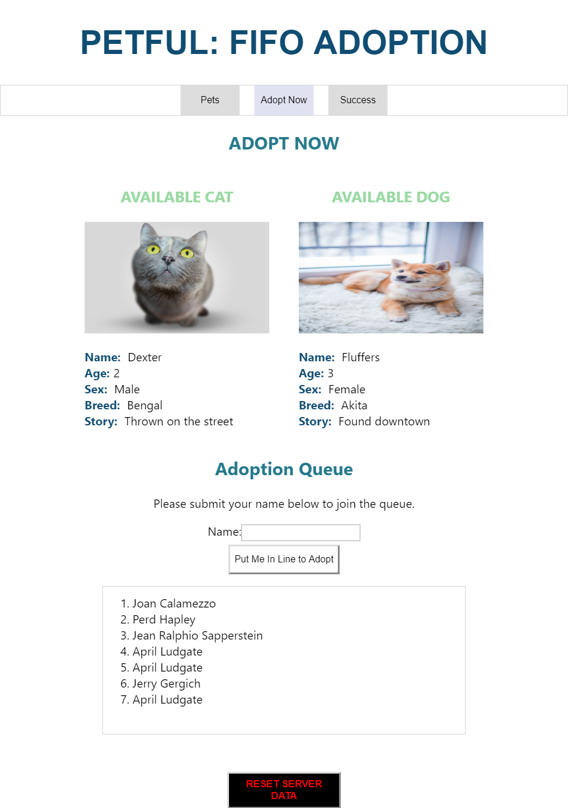
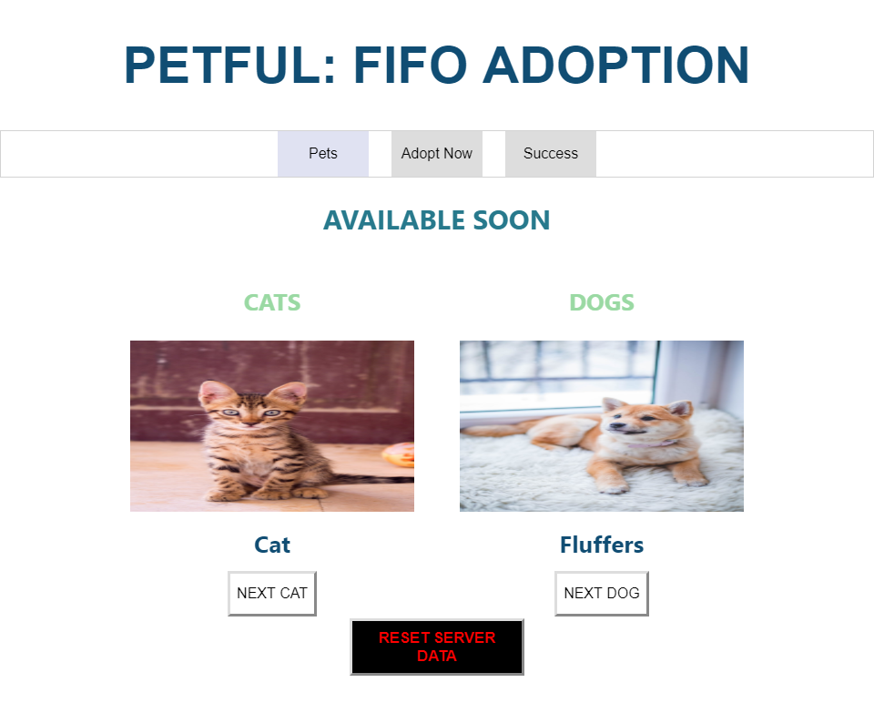
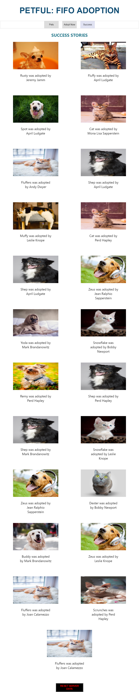

### Petful Client

#### Team Members
 Alex Bannow and Shannon Lichtenwalter

#### Introduction
  Your future pet is waiting for you! Petful is an easy to use pet adoption site. We have dogs and cats available for adoption. Our motto here at Petful is 'First In First Out'. This means that we only have one dog and one cat available to adopt at a time. Only the cat and dog that have been at our shelter the longest are available for adoption.

  So how does it work? If you are interested in adopting a pet please get in line to adopt. You will have to wait until it is your turn in line to adopt your new pet(s). Once you are first in line you will be given the option to adopt our available dog, our available cat, or both! You will have thirty seconds to decide if you would like to adopt before being moved to the back of the line again.

  Be sure to check out our success story page to see all of the happy pets that have been adopted through Petful! Also, feel free to check out our Pets page to view pets that will soon be up for adoption.

  ##### Adoption Page
  

  ##### Pets Page
  

  ##### Success Page
  

#### Relevant Links
  Github repo: https://github.com/thinkful-ei-heron/petful_client_alex_shannon
  Live App: https://petfulclient.rbannal.now.sh/
  Server Github repo: https://github.com/thinkful-ei-heron/petful_server_alex_shannon
  Server URL: https://salty-hollows-30740.herokuapp.com/

#### Tech Stack
  HTML
  CSS
  Javascript
  React
